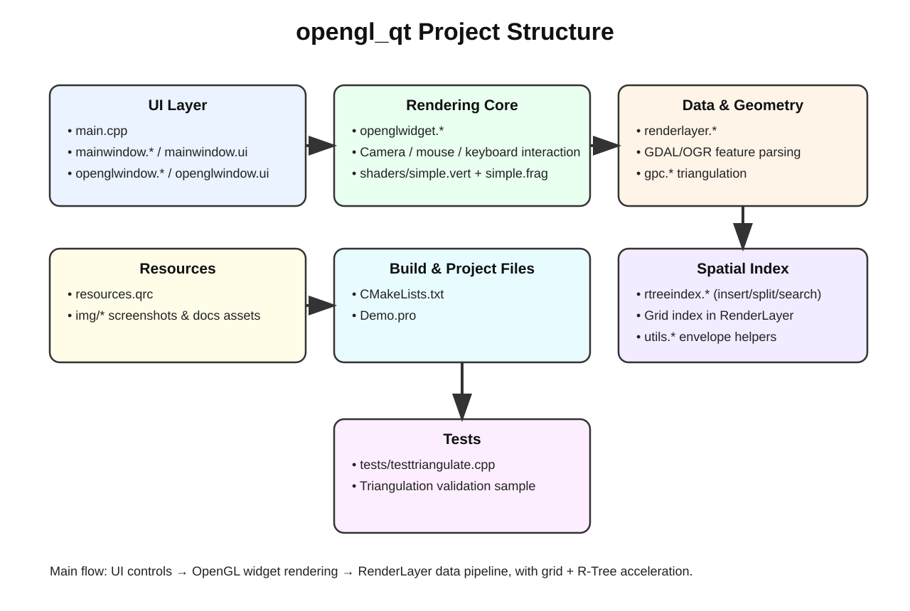

# 在Qt中使用OpenGL画地图

- 使用管线模式(pipeline)即核心模式(code mode)
- 简单绘制模式早已被弃用，没有学习价值
- DirectX


## Quick Start

> 下面给出 **CMake** 和 **qmake** 两种方式，任选一种即可。

### 1) 环境依赖

- Qt 5（含 Widgets / OpenGL 相关模块）
- CMake 3.19+（若用 CMake 构建）
- GDAL 开发库（头文件 + 动态/静态库）
- C++14 编译器

> `CMakeLists.txt` 使用 `LIB_DIR` 环境变量查找 GDAL：
> - 头文件：`$LIB_DIR/include`
> - 库文件：`$LIB_DIR/lib`

### 2) 使用 CMake 构建与运行

```bash
# Linux / macOS
export LIB_DIR=/path/to/your/deps
cmake -S . -B build
cmake --build build -j
./build/opengl_qt
```

```powershell
# Windows (PowerShell)
$env:LIB_DIR="D:/3rdparty"
cmake -S . -B build
cmake --build build --config Release
./build/Release/opengl_qt.exe
```

### 3) 使用 qmake 构建（Demo.pro）

> 注意：`Demo.pro` 中目前包含 **Windows 下的绝对路径** (`INCLUDEPATH` / `LIBS` 指向本机 GDAL 目录)，
> 在其他环境（或你的 Windows 机器）上使用前，必须先根据自己的 GDAL 安装位置手动修改这些路径
> （或自行参数化，例如使用环境变量）。否则，直接运行 `qmake Demo.pro` 很可能会导致编译失败。
>
> 推荐优先使用上面的 **CMake 构建方式**；qmake 仅作为示例/备用方案提供。

```bash
qmake Demo.pro
make -j
./Demo
```

### 4) 运行后怎么体验

- 程序会同时打开 `MainWindow` 和 `OpenGLWindow`。
- 在 `OpenGLWindow` 中点击按钮加载 `.shp` 文件。
- 可使用鼠标拖拽/滚轮进行平移缩放，右键拖动视角，配合复选框测试旋转、选择、密度分析等功能。

## Project Structure

这个项目是一个基于 **Qt + OpenGL + GDAL/OGR** 的地图渲染实验，核心流程是：
**UI 选择数据 → RenderLayer 解析与索引 → OpenGLWidget 渲染与交互显示**。

### 核心代码

- **入口与窗口层**
  - `main.cpp`：创建 `MainWindow` 与 `OpenGLWindow`。
  - `mainwindow.*`：基础 Qt 窗口与示例文件读取逻辑。
  - `openglwindow.*` + `openglwindow.ui`：OpenGL 窗口控制面板（加载 shp、旋转、密度、清空图层、选择开关等）。

- **渲染与交互层**
  - `openglwidget.*`：OpenGL 初始化、Shader 绑定、图层绘制、鼠标/键盘交互（平移、缩放、选择、相机漫游）。
  - `shaders/simple.vert`、`shaders/simple.frag`：顶点/片元着色器。

- **数据处理层（核心）**
  - `renderlayer.*`：
    - 读取 OGR 图层、抽取要素顶点；
    - 建立规则网格索引用于快速筛选；
    - 面要素三角化（`gpc.*`）；
    - 选择查询、密度计算与渲染数据准备；
    - 输出 R-Tree 骨架调试顶点。

- **空间索引与工具**
  - `rtreeindex.*`：自定义 R-Tree（插入、分裂、搜索、MBR 维护）。
  - `utils.*`：OGREnvelope 面积、合并增量等工具函数。

- **构建与测试**
  - `CMakeLists.txt` / `Demo.pro`：CMake 与 qmake 工程配置。
  - `tests/testtriangulate.cpp`：三角化相关测试样例。

### 关键特性

- 支持 Shapefile 加载与基础属性查询。
- 支持点/线/面渲染，面要素支持三角化渲染。
- 支持鼠标框选/点选、相机旋转与缩放。
- 支持点密度分析可视化。
- 内置规则网格索引 + R-Tree 结构用于空间检索与调试展示。

### Structure Diagram



# 备注
- 这个代码是一个星期赶出来的，注释没写清楚、代码功能也都没有重构封装
- 当时时间有限，怎么方便怎么来，写出了这种无法维护的代码QAQ
